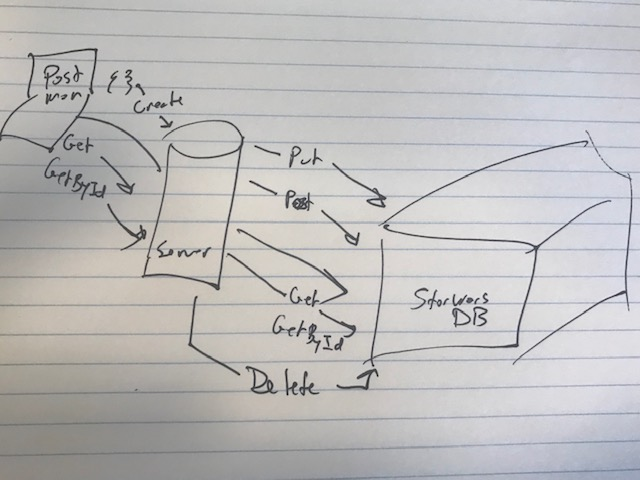

# LAB - 06

## Star Wrars Mongo/Mongoose

### Author: Joe Klause

### Links and Resources
* [submission PR](https://github.com/josephklause-401-advanced-javascript/lab-06/pull/1)
* [travis](https://travis-ci.com/josephklause-401-advanced-javascript/lab-06/builds/128832570)

### Setup
#### `.env` requirements
* MONGODB_URI=mongodb://localhost:27017/(your-db)

#### Running the app
* npm run start
    starts node on server.js
* npm run start-watch
    starts nodemon onm server server.js
* npm run test
    runs jest test once
* npm run test-watch
    runs jest test whenever there is a change
* npm run lint
    runs eslint
    
  
#### Tests
* Unit Tests: 'npm test'
* Lint Tests: 'npm run lint'

#### UML

